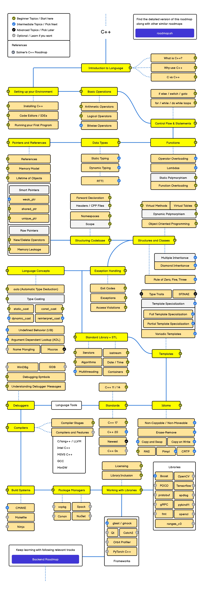

# ROBOCON WORKSHOP - BASIC C / C++

## 👀 Overview
This repository contains the source code and documentation for the ROBOCON Workshop, which focuses on teaching the basics of C and C++ programming languages. The workshop is designed for beginners who want to learn programming concepts and apply them in robotics projects.

---

## 📚 Contents
The repository is organized into chapters, each covering a specific topic in C/C++ programming. Click a chapter title below to expand its contents.

- [Introduction to C / C++](#chapter-0---introduction-to-cc)
- [Structure of Program](#chapter-1---structure-of-program)
- [Printing Messages](#chapter-2---printing-messages-to-console)
- [Variables and Data Types](#chapter-3---variables-and-data-types)
- [Operators](#chapter-4---operators)
- [Array and Strings](#chapter-5---array-and-strings)
- [Basic Input and Output](#chapter-4---basic-input-and-output)
- [Logic Operation and Condition](#chapter-5---logic-operation-and-condition)
- [Loops](#chapter-6---loops)
- [Functions](#chapter-7---functions)
- [Pointers and Address](#chapter-8---pointers-and-address)
- [Object-Oriented Programming (Class and Structure)](#chapter-9---object-oriented-programming-class-and-structure)
- [Cheatsheet](#chapter-10---cheatsheet)
- [End...?](#chapter-11---end)

---

<details>
<summary><b>Chapter 0 - Introduction to C/C++</b></summary>

This chapter introduces the C and C++ programming languages, explaining syntax, and where they are used in robotics.

**Why Learn C++:**
1. Foundation of many modern languages
- C / C++ is in everything!
- C#, Java, Python, and more are influenced by C++!

2. Teaches Logical and Structured Thinking
- C / C++ is strict with syntax, if you had familliar with C / C++, learning other languages is VERY EASY!
- Programming language have many, but logical thinking within is ALL THE SAME!

3. Used in Embedded System, AI Performances Modules, Backend of Games
- Arduino, STM32, and other microcontrollers use C/C++.
- Robot Operating System (ROS) relies heavily on C++.
- Even AI hardware like Raspberry Pi AI HATs are built on C++ backbones.
- Master C++ make you advance than others in University!

**Tools for Programming:**
1. Integrated Development Environment (IDE)
- VS Code – Lightweight, supports many languages with extensions.
- Eclipse – Commonly used for Java, but supports C/C++ too.
- IntelliJ IDEA – Professional IDE, powerful but heavier.

2. Exclusive Programming Tools for C++/C
- CodeBlocks - Beginner-friendly and easy to set up.
- Dev-C++ - Simple, old but lightweight.

3. Online Compiler
- Programiz.com
- Replit.com
- OnlineGDB.com (WE ARE GOING TO USE IT TODAY!)

</details>

---

<details>
<summary><b>Chapter 1 - Structure of Program</b></summary>

Understand how a basic C/C++ program is structured — including headers, the `main()` function, statements, and compilation flow.

A typical C / C++ file `main.c` or `main.cpp` look like this:

```cpp
#include <iostream>     // This is the library for C++
using namespace std;    // Using namespace std function keep codes clean!

int main() { // main() is the entry point of the software (Imagine it is where will be run when the code started!)
    cout << "Hello World" << endl;  // cout will print the messages, endl will end this messages and move to next line.
    return 0;  // return zero tells the computer that this software had ended
}
```

If without using namespace std, the code look messy, such as below:

```cpp
#include <iostream>     // This is the library for C++

int main() {
    std::cout << "Hello World" << std::endl; // It look messy, we don't like this!
    return 0;
}
```

In a typical C / C++ file, several library will be used, but for the context of today, we will only focuses on <iostream> only!

</details>

---

<details>
<summary><b>Chapter 2 - Printing Messages To Console</b></summary>

Typically, we will have to print the messages to the console through some codes. 

In summary, there are several way that we can 
There is several variation for the codes as well!

| Function Type | Law | Description | Example of Uses |
|-----------|-----------|-----------|-----------|
| cout | - The messages need to put within `" "` and need to use `<<`, `endl` to mark it is the end of the line. Noted that all of this are coming from <iostream> library, so you will have to add `std::` or `using namespace std;` to mark it.  | Print messages within the `"Messages"` | `cout << "Hello!" << endl;` |
| printf | Based from C language library. The only rules is to put `" "` for the messages. | Stores Decimal (2.17, 3,14, 11.17) | `float pi = 3.14;` |

There are also tons of thing that we can do for these `cout` and `printf` as well, which we will be discuss in the later part of the workshop.

Example of uses for cout function:
```cpp
#include <iostream>
using namespace std;

int main() {
    cout << "Hello!" << endl;
    return 0;
}
```

Example of uses for printf function:
```cpp
#include <stdio.h>

int main() {
    printf("Hello!\n");
    return 0;
}
```

You can try the codes below to see what are the ways to print a message in C++.

```cpp
#include <iostream>     // Library for cout
#include <stdio.h>      // Library for printf
using namespace std;

int main() {
    cout << "Hello Robocon" << endl;    // endl move the next message to next line
    cout << "Hello Robocon \n" ;        // \n move the next message to next line too!
    printf("Hello Robocon!");           // old style of printing message, from C
    return 0;
}
```

</details>

---

<details>
<summary><b>Chapter 3 - Variables and Data Types</b></summary>

Learn how to declare variables, use different data types, and understand memory allocation in C/C++.

There is a lot of data type in C / C++, and you can decide which type of data type to use.

Remember that the name assignation is case sensitive (eg: a is not A) and no symbol should be used (except `-` and `_`).

| Data Type | Size | Description | Example of Uses |
|-----------|-----------|-----------|-----------|
| int | 4 Byte (32 Bits) | Stores Integer (-1, 3, 6, 8) | `int age = 3;` |
| float | 4 Bytes (32 Bits) | Stores Decimal (2.17, 3,14, 11.17) | `float pi = 3.14;` |
| double | 8 Bytes (64 Bits) | Stores Decimal (Better precision than `float`) | `double pi = 3.14159` |
| long | 4 Bytes (32 Bits) | Stores Decimal (Better precision than `double`) | `long pi = 3.14159` |
| char | 1 Byte (1 Bits) | Stores only one character (a, A, b, B) | `char grade = 'A';` |
| string | - | Stores Words, Phrases or Sentences | `string Name = "Universiti Sains Malaysia";` |

Double is better than float, and long is better than double in terms of precision, but oftem the more precision consume larger memory.

The cool things about variable is, you can always display it in anywhere. Even cooler, you can manipulate it in many ways you might wanted, from printing messages to writing OOP, or even addresses, you will see them anywhere.

One of the common way of using variable is to print them on the messages.

You can use `cout` function to print out the variable with just some tweaks on the 'sentences'. For example:
```cpp
#include <iostream>
using namespace std;

int main(){
    int number = 18;    // A variable that stores number
    cout << "My scores for calculus exam is " << number << endl;        // You can put the variable at the end of the sentences
    cout << "I'll always be " << number << " years old. " << endl;      // You can put the variable at the middl eof the sentences
}
```

You can use `printf` to print out the vairable too.
```cpp
#include <stdio.h>

int main(){
    int number = 30;
    int brotherNumber = 35;
    int sisterNumber = 30;
    printf("There is only %d minutes over for this workshop but I feel so sleepy already...", number);
    // %d means putting a integer in the printf function, there are also several type of name for each data type. You can refer to the table below.
    printf("I have %d brothers and %d sister in my family. How many family member do I have?", brotherNumber, sisterNumber);
    // You can also put more than one variable in the printf function
    // The sequence of assigning each variable to each %d follow the sequence of their appearance in the printf function
}
```

For `printf` function is a bit of special (As it is old aged :( ). You may follow the character set below to print the variable out by using `printf`.


| **Specifier** | **Type**                 | **Example** | **Output Example** | **Description** |
|----------------|--------------------------|--------------|--------------------|------------------|
| `%d` or `%i`  | `int`                    | `printf("%d", 10);` | `10` | Prints an integer (decimal) |
| `%f`          | `float` / `double`       | `printf("%f", 3.14);` | `3.140000` | Prints floating-point number |
| `%.2f`        | `float` / `double`       | `printf("%.2f", 3.14159);` | `3.14` | Prints float with 2 decimal places |
| `%c`          | `char`                   | `printf("%c", 'A');` | `A` | Prints a single character |
| `%s`          | `char[]` / string (C-style) | `printf("%s", "Hello");` | `Hello` | Prints a C-style string |
| `%u`          | `unsigned int`           | `printf("%u", 300);` | `300` | Prints unsigned integer |
| `%ld`         | `long int`               | `printf("%ld", 123456L);` | `123456` | Prints long integer |
| `%lld`        | `long long int`          | `printf("%lld", 123456789LL);` | `123456789` | Prints long long integer |
| `%p`          | Pointer (address)        | `printf("%p", ptr);` | `0x7ffee4a9b8` | Prints memory address |
| `%x`          | Hexadecimal (lowercase)  | `printf("%x", 255);` | `ff` | Prints in base 16 (hex) lowercase |
| `%X`          | Hexadecimal (uppercase)  | `printf("%X", 255);` | `FF` | Prints in base 16 (hex) uppercase |
| `%o`          | Octal                    | `printf("%o", 9);` | `11` | Prints in base 8 (octal) |
| `%%`          | Literal `%`              | `printf("100%%");` | `100%` | Prints a literal percent sign |

Codes below show how you can assign each character in C++. Please paste this code and experiment by your own

```cpp
#include <iostream>
using namespace std;

int main() {
    int age = 18;           // Assign integer on type int
    float height = 1.75;    // Assign decimal on type float
    char grade = 'A';       // Assign one character only on type char
    string name = "Ali";    // Assign Words/Phrases/Sentences to string

    // This part of the code will print all of the variables out by using cout function
    cout << "Name: " << name << endl;
    cout << "Age: " << age << endl;
    cout << "Height: " << height << "m" << endl;
    cout << "Grade: " << grade << endl;
    return 0;
}
```

You may experiment with `printf` function by your own too.

```cpp
#include <stdio.h>

int main() {
    int age = 18;
    float pi = 3.14159;
    char grade = 'A';
    const char* name = "Ali";

    printf("Name: %s\n", name);
    printf("Age: %d\n", age);
    printf("Grade: %c\n", grade);
    printf("Pi: %.2f\n", pi);
    printf("Address of age: %p\n", &age);
    return 0;
}
```

</details>

---

<details>
<summary><b>Chapter 4 - Operators</b></summary>

Operators are symbols that perform actions on data — like addition, subtraction, and comparison.

For the context of C / C++, there are three major type of basic operators:

- [Arithmetic Operators](#arithmetic-operators)
- [Logical Operators](#logical-operators)
- [Bitwise Operators](#bitwise-operators)

The detailed description and respective example had been listed in below: 

## Arithmetic Operators
<a name="arith"></a>

| **Operator** | **Example** | **Description** |
|---------------|-------------|-----------------|
| `+` | `a + b` | Addition |
| `-` | `a - b` | Subtraction |
| `*` | `a * b` | Multiplication |
| `/` | `a / b` | Division |
| `%` | `a % b` | Modulus (remainder after division) |

---

Apart from these, there is also another variation of arithmetic operators that called Assignment Operators. Basically they do the same thing, but just different form of writing style.

However, do note that this is the most commonly written style of C++ in terms of embedded language and many other application area.

| **Operator** | **Example** | **Same As** | **Description** |
|---------------|-------------|--------------|-----------------|
| `=`  | `a = 10` | — | Assigns a value to variable |
| `+=` | `a += 5` | `a = a + 5` | Adds and assigns |
| `-=` | `a -= 3` | `a = a - 3` | Subtracts and assigns |
| `*=` | `a *= 2` | `a = a * 2` | Multiplies and assigns |
| `/=` | `a /= 4` | `a = a / 4` | Divides and assigns |
| `%=` | `a %= 2` | `a = a % 2` | Modulus and assigns |

Often time, you will also need to increases/ decreases the number of your variable in your code as well. (Excessively uses in `loop`)

For the time being, you can too just leave it as it is, just remember it exist. We wiill come back to this again when we discuss about the `loop`

| **Operator** | **Example** | **Description** |
|---------------|-------------|-----------------|
| `++` | `a++` or `++a` | Increase value by 1 |
| `--` | `a--` or `--a` | Decrease value by 1 |

You may refer to the example codes below to see how they work in actual code.

```cpp
#include <iostream>
using namespace std;

int main() {
    int a = 10, b = 3;

    cout << "===== Arithmetic Operators =====" << endl;
    cout << "a + b = " << a + b << endl;  // Addition
    cout << "a - b = " << a - b << endl;  // Subtraction
    cout << "a * b = " << a * b << endl;  // Multiplication
    cout << "a / b = " << a / b << endl;  // Division (integer division)
    cout << "a % b = " << a % b << endl;  // Modulus (remainder)
    cout << endl;

    cout << "===== Assignment Operators =====" << endl;
    int num = 10;
    num += 5; // same as num = num + 5
    cout << "num += 5 → " << num << endl;
    num -= 3;
    cout << "num -= 3 → " << num << endl;
    num *= 2;
    cout << "num *= 2 → " << num << endl;
    num /= 4;
    cout << "num /= 4 → " << num << endl;
    num %= 3;
    cout << "num %= 3 → " << num << endl;
    cout << endl;

    cout << "===== Increment / Decrement =====" << endl;
    int x = 5;
    cout << "x++ = " << x++ << "  (use then increase)" << endl;
    cout << "++x = " << ++x << "  (increase then use)" << endl;
    cout << "x-- = " << x-- << "  (use then decrease)" << endl;
    cout << "--x = " << --x << "  (decrease then use)" << endl;

    return 0;
}
```
---

## Logical Operators
<a name="logic"></a>

Logical operators commonly uses in `if-else` case, which we will be discussing later. For the the time being, you can just take note that there exist something like this.

| **Operator** | **Example** | **Description** |
|---------------|-------------|-----------------|
| `==` | `a == b` | Equal to |
| `!=` | `a != b` | Not equal to |
| `>` | `a > b` | Greater than |
| `<` | `a < b` | Less than |
| `>=` | `a >= b` | Greater than or equal to |
| `<=` | `a <= b` | Less than or equal to |

Logic expression often come with several cases to compare them. Remember the math you learn in Pre-U/Matriks/Poly/Diploma? This is when you can use them!

| **Operator** | **Example** | **Description** |
|---------------|-------------|-----------------|
| `&&` | `a > 0 && b > 0` | Logical AND (true if both are true) |
| `\|\|` | `a > 0 \|\| b > 0` | Logical OR (true if one is true) |
| `!` | `!a` | Logical NOT (reverses true/false) |

This is useful as in the context of software proramming or robotics, we often have to compare different case to give the optimum result.

You may refer to the example codes below to see how they work in actual code.

```cpp
#include <iostream>
using namespace std;

int main() {
    int a = 10, b = 5;

    cout << "===== Relational Operators =====" << endl;
    cout << "a == b : " << (a == b) << endl; // Equal to
    cout << "a != b : " << (a != b) << endl; // Not equal
    cout << "a > b  : " << (a > b) << endl;  // Greater than
    cout << "a < b  : " << (a < b) << endl;  // Less than
    cout << "a >= b : " << (a >= b) << endl; // Greater or equal
    cout << "a <= b : " << (a <= b) << endl; // Less or equal
    cout << endl;

    cout << "===== Logical Operators =====" << endl;
    bool x = true, y = false;

    cout << "(x && y) = " << (x && y) << "  (true if both true)" << endl;
    cout << "(x || y) = " << (x || y) << "  (true if at least one true)" << endl;
    cout << "(!x) = " << (!x) << "  (negation of x)" << endl;

    // Real-life example
    int temp = 35;
    if (temp > 30 && temp < 40)
        cout << "It's a warm day!" << endl;
    else
        cout << "Temperature is normal." << endl;

    return 0;
}
```

---

## Bitwise Operators

Bitwise operators is one of the advance operators in C / C++. You may try to familiar with he operators before first before advancing into this operator type.

Bitwise operators perform operations on individual bits of integers (in binary temrs).  
They are often used in embedded systems, microcontroller programming, and low-level hardware control.

But for the time being, you can familiar yourself with the operators before first.

| Operator | Example | Description | Binary Example |
|---------------|-------------|-----------------|--------------------|
| `&` | `a & b` | Bitwise AND (1 if both bits are 1) | `0101 & 0011 → 0001` |
| `\|` | `a \| b` | Bitwise OR (1 if either bit is 1) | `0101 \| 0011 → 0111` |
| `^` | `a ^ b` | Bitwise XOR (1 if bits are different) | `0101 ^ 0011 → 0110` |
| `~` | `~a` | Bitwise NOT (inverts all bits) | `~0101 → 1010` |
| `<<` | `a << 1` | Left shift (multiply by 2) | `0101 << 1 → 1010` |
| `>>` | `a >> 1` | Right shift (divide by 2) | `0101 >> 1 → 0010` |

---

You may refer to the example codes below to see how they work in actual code.

```cpp
#include <iostream>
using namespace std;

int main() {
    unsigned int p = 5;  // Binary: 0101
    unsigned int q = 9;  // Binary: 1001

    cout << "===== Bitwise Operators =====" << endl;
    cout << "p = " << p << " (0101)" << endl;
    cout << "q = " << q << " (1001)" << endl;
    cout << endl;

    cout << "p & q = " << (p & q) << "  // AND  (0101 & 1001 = 0001 = 1)" << endl;
    cout << "p | q = " << (p | q) << "  // OR   (0101 | 1001 = 1101 = 13)" << endl;
    cout << "p ^ q = " << (p ^ q) << "  // XOR  (0101 ^ 1001 = 1100 = 12)" << endl;
    cout << "~p = " << (~p) << "        // NOT  (inverts all bits)" << endl;
    cout << "p << 1 = " << (p << 1) << " // Left shift (multiply by 2)" << endl;
    cout << "q >> 1 = " << (q >> 1) << " // Right shift (divide by 2)" << endl;

    return 0;
}

```

---
</details>

---

<details>
<summary><b>Chapter 5 - Array and Strings</b></summary>

An array is a collection of variables of the same type, stored together in continuous memory locations.

Imagine an array as a row of houses, each holding a value. Each house has an address (index), and inside it lives a value.

Noted that an array must always have a fixed size in C / C++. This means that we will have to declare a size for the array before the program start.

For example:
```cpp
int numbers[5] = {10, 20, 30, 40, 50};
```
In the example above, the index of each value is:

 | **Index** | 0 | 1 | 2 | 3 | 4 |
|------------|---|---|---|---|---|
| **Value** | 10 | 20 | 30 | 40 | 50 |

`numbers[0]` refers to `10`
`numbers[4]` refers to `50`

So, if you want to call the number `20`, you can use:

```cpp
#include <iostream>
using namespace std;

int main(){
    int numbers[5] = {10, 20, 30, 40, 50};
    cout << numbers[1] << endl;
    return 0;
}

A 1D array is simply a list of values — like a line of data.

```cpp
#include <iostream>
using namespace std;

int main() {
    int arr[5] = {10, 20, 30, 40, 50};

    cout << "1D Array Example:" << endl;
    for (int i = 0; i < 5; i++) {
        cout << "Element at index " << i << " = " << arr[i] << endl;
    }

    return 0;
}
```
The output should be:
```perl
Element at index 0 = 10
Element at index 1 = 20
Element at index 2 = 30
Element at index 3 = 40
Element at index 4 = 50
```

For 2D Arrays, it looks like a table — it has rows and columns. It is commonly used for matrices, maps, or grids in robotics.

2D Arrays often work with `nested loop`. We will look back at this again once we learnt about `loop`

```cpp
// This program will demonstrate and print out all of the element in the 2D Array.
#include <iostream>
using namespace std;

int main() {
    int matrix[2][3] = {
        {1, 2, 3},
        {4, 5, 6}
    };

    cout << "2D Array Example:" << endl;
    for (int row = 0; row < 2; row++) {
        for (int col = 0; col < 3; col++) {
            cout << matrix[row][col] << " ";
        }
        cout << endl;
    }

    return 0;
}
```
The output should be:
```perl
1 2 3
4 5 6
```

For 3D Array, a 3D array is like a cube — a collection of 2D layers stacked together.
Used in simulations, color images (RGB values), or robotics mapping.

Same as 2D Array, it also oftem uses `nested loop` to effectively use the feature optimumly.

```cpp
// This program will demonstrate and print out all of the element in the 3D Array.
#include <iostream>
using namespace std;

int main() {
    int cube[2][2][2] = {
        {{1, 2}, {3, 4}},
        {{5, 6}, {7, 8}}
    };

    cout << "3D Array Example:" << endl;
    for (int i = 0; i < 2; i++) {
        for (int j = 0; j < 2; j++) {
            for (int k = 0; k < 2; k++) {
                cout << cube[i][j][k] << " ";
            }
            cout << endl;
        }
        cout << "--- Layer " << i << " ---" << endl;
    }

    return 0;
}
```
The output should be:
```perl
1 2 
3 4 
--- Layer 0 ---
5 6 
7 8 
--- Layer 1 ---
```

Higher Dimensions (4D and Beyond) exist too (Theoritically you can put infinitly layer of boxes into one box <3)

But in real projects, it’s uncommon and hard to manage.

For larger data, we typically use structs, vectors, or classes instead(OOP). 

Example declaration of a 4D Array:

```cpp
int data4D[2][2][2][2];
```

`String` are arrays of characters, ending with a special character '\0' (null terminator).Essentiatlly string is just an array of `char`.

There are two common ways to handle strings in C++:

1. C-Style String (Because C have no string in Nature, only workable alternative)

```cpp
#include <iostream>
using namespace std;

int main() {
    char name[6] = "HELLO";  // H E L L O \0
    cout << "C-Style String: " << name << endl;
    return 0;
}
```

2. C++ String (Safer and Easier)

```cpp
#include <iostream>
#include <string>
using namespace std;

int main() {
    string name = "Robocon!";
    cout << "C++ String: " << name << endl;
    cout << "Length of string: " << name.length() << endl;
    return 0;
}
```

</details>

---

<details>
<summary><b>Chapter 6 - Basic Input and Output</b></summary>

In C++, the most common ways to handle input and output are through:
- `cout` → for **output**
- `cin` → for **input**

Both come from the `<iostream>` library and are part of the `std` namespace.

```cpp
#include <iostream>
using namespace std;

int main() {
    cout << "Hello, Robocon!" << endl;     // prints text with newline
    cout << "The answer is " << 42 << endl; // prints numbers and text together
    return 0;
}
```

`endl` inserts a newline (same as `\n`) and flushes the output buffer.

`cin` reads data until a space or newline.
If you want to get a full line of text (including spaces), you can use:

```cpp
getline(cin, name);
```

You can also take multiple input in one line:

```cpp
#include <iostream>
using namespace std;

int a, b, c;
cout << "Enter three numbers: ";
cin >> a >> b >> c;
cout << "Sum = " << a + b + c << endl;
```

Bonud Tips:
For The `cout` and `printf`, there are also several character that you can put to achieve special effect:

| Sequence | Description  |
| -------- | ------------ |
| `\n`     | New line     |
| `\t`     | Tab space    |
| `\\`     | Backslash    |
| `\"`     | Double quote |
| `\'`     | Single quote |

Here are the example full code for you to explore how to combining input and output from terminal:

```cpp
#include <iostream>
using namespace std;

int main() {
    string name;
    int age;
    double height;

    cout << "Enter your name, age, and height: ";
    cin >> name >> age >> height;

    cout << "\n--- Profile ---" << endl;
    cout << "Name: " << name << endl;
    cout << "Age: " << age << endl;
    cout << "Height: " << height << " m" << endl;

    return 0;
}
```

</details>

---

<details>
<summary><b>Chapter 7 - Logic Operation and Condition</b></summary>

In programming, **logic and conditions** allow your code to make decisions — just like how humans think:  
> “If it’s raining, bring an umbrella.”

In C++, logical and relational operators are used inside conditional statements such as `if`, `else if`, and `else`.

These are used to **compare values**.  
The result is always **true (1)** or **false (0)**.

| Operator | Example | Description |
|-----------|----------|-------------|
| `==` | `a == b` | Equal to |
| `!=` | `a != b` | Not equal to |
| `>`  | `a > b` | Greater than |
| `<`  | `a < b` | Less than |
| `>=` | `a >= b` | Greater than or equal to |
| `<=` | `a <= b` | Less than or equal to |

Example:

```cpp
int a = 5, b = 10;
cout << (a < b) << endl;  // prints 1 (true)
cout << (a == b) << endl; // prints 0 (false)
```
You can also work with the logic operators before to make more complex logics as below:

```cpp
int a = 5, b = -3;

if (a > 0 && b > 0)
    cout << "Both are positive" << endl;
else if (a > 0 || b > 0)
    cout << "At least one is positive" << endl;
else
    cout << "Both are non-positive" << endl;
```

The example structure of the code should look like this:

```cpp
#include <iostream>
using namespace std;

int main() {
    int temperature;
    cout << "Enter temperature: ";
    cin >> temperature;

    if (temperature > 30)
        cout << "It's hot outside!" << endl;
    else if (temperature >= 20)
        cout << "Nice weather today!" << endl;
    else
        cout << "It's quite cold!" << endl;

    return 0;
}
```

The condition in bracket () must only equal to either true or false.

There are also a shorthand method of writing this:

```cpp
condition ? value_if_true : value_if_false;
```

For example:

```cpp
int a = 10, b = 20;
int max = (a > b) ? a : b;
cout << "The larger number is " << max << endl;
```

Now, that you have learn this, try to write a code to decide if the student had failed or not failed the exam, based on the marks input.

You can make a reference on the example code:

```cpp
#include <iostream>
using namespace std;

int main() {
    int score;
    cout << "Enter your score: ";
    cin >> score;

    if (score >= 50)
        cout << "You passed!" << endl;
    else
        cout << "You failed!" << endl;

    return 0;
}
```

</details>

---

<details>
<summary><b>Chapter 8 - Loops</b></summary>

There are three type of loops in C / C++:
- `while-loop` 
- `do-while-loop`
- `for-loop`

The structure of the `while-loop`:

```cpp
#include <iostream>

int main() {
    bool loop = true;
    while(loop == true){
        // You can also put like: while(loop){};
        // Execute the code here
    };
    return 0;
}
```

The structure of the `do-while-loop`:

```cpp
#include <iostream>

int main() {
    bool loop = true;
    do{
        // Execute the code here
        // Code here will be executed once before ended
    }while(loop);
    return 0;
}
```

The structure of the `for-loop`:

```cpp
#include <iostream>

int main() {
    bool loop = true;
    for(int i = 0; i<10; i++){
        // Execute the code here
        // Code here will executed once for every iteration
        // The int i will increases by 1 after each iteration
        // Only when the i>=10, the code ends.
    }
    return 0;
}
```

There are several case that we should take note:

1. Super Loop:
Super loops means the loop that will run indefinitely, unless forcefully breaks. The example code will be look like this:

```cpp
while(true){
    // The super loop run until the end of time...
}
```

2. Break:
You can always run the code `break;` in the loops to break the loop (forcefully break) at any instance. The example code will be look like this:

```cpp
while(1){
    // The super loop run until the end of time...
    // unless...
    if(userInput == true){
        break;
    }
}
```

</details>

---

<details>
<summary><b>Chapter 9 - Switch Function</b></summary>

Sometimes you’ll have **many conditions** to check — using too many `if-else` statements can make your code messy.  
This is where `switch-case` comes in handy!

It allows you to **compare one variable against multiple constant values** in a clean way.

Basic form of Switch Function will look like this:

```cpp
switch (variable) {
    case value1:
        // Code to run if variable == value1
        break;

    case value2:
        // Code to run if variable == value2
        break;

    default:
        // Code to run if no case matches
        break;
}
```

Each `case` must end with a `break`; statement to prevent “fall-through.”

`default` is optional — it runs when none of the cases match.

An excellent example of switch case is Translate the Number of Day in Week to the Day;

Eg: 2 -> Tuesday

```cpp
#include <iostream>
using namespace std;

int main() {
    int day;
    cout << "Enter a number (1-7): ";
    cin >> day;

    switch (day) {
        case 1:
            cout << "Monday" << endl;
            break;
        case 2:
            cout << "Tuesday" << endl;
            break;
        case 3:
            cout << "Wednesday" << endl;
            break;
        case 4:
            cout << "Thursday" << endl;
            break;
        case 5:
            cout << "Friday" << endl;
            break;
        case 6:
            cout << "Saturday" << endl;
            break;
        case 7:
            cout << "Sunday" << endl;
            break;
        default:
            cout << "Invalid input! Please enter 1–7." << endl;
            break;
    }

    return 0;
}
```

switch only works with integer, character, or enum types, not floating-point or strings.

When multiple cases share the same output, you can group them:

```cpp
#include <iostream>
using namespace std;

int main() {
    switch (grade) {
        case 'A':
        case 'B':
            cout << "Good job!" << endl;
            break;
        case 'C':
            cout << "You passed." << endl;
            break;
        default:
            cout << "Try again!" << endl;
            break;
    }
}
```

---

</details>

---

<details>
<summary><b>Chapter 10 - Functions</b></summary>

Functions are **reusable blocks of code** that perform a specific task.  
Instead of writing the same code multiple times, you can **define a function once** and call it whenever needed.

They help make your program:
- Easier to read and maintain
- More organized and modular
- Easier to debug and test

The basic structure of a Function will look like this:

```cpp
return_type function_name(parameters) {
    // Code to execute
    return value;  // (optional)
}
```

| **Part**        | **Meaning**                                                      |
| --------------- | ---------------------------------------------------------------- |
| `return_type`   | Type of value the function returns (e.g. `int`, `float`, `void`) |
| `function_name` | Name you give to the function                                    |
| `parameters`    | Data passed into the function                                    |
| `return`        | Sends a value back to where the function was called              |

For example, you can write a code like following:

```cpp
#include <iostream>
using namespace std;

void greet() {              // Function declaration
    cout << "Hello there!" << endl;
}

int main() {
    greet();                // Function call
    greet();                // Call again
    return 0;
}
```

This prints “Hello there!” twice. The function `greet()` is reusable. This means that whenever we called a greet(), the lines of codes within the function `greet()` will be run immediately

Another example below will show how you can do more operation within a function

```cpp
#include <iostream>
using namespace std;

int add(int a, int b) {      // Function with parameters
    return a + b;            // Returns sum
}

int main() {
    int result = add(5, 3);  // Pass arguments to the function
    cout << "Sum = " << result << endl;
    return 0;
}
```

By returnning the `a+b`, we can get the value of sum easily everytime when we run the function `add()`.

In larger programs, we usually declare the function before main() and define it later in the code.

```cpp
#include <iostream>
using namespace std;

void sayHello();      // Function declaration (prototype)

int main() {
    sayHello();       // Function call
    return 0;
}

void sayHello() {     // Function definition
    cout << "Hello World!" << endl;
}
```

</details>

---

<details>
<summary><b>Chapter 11 - Pointers and Address</b></summary>

A **pointer** is a variable that stores the **memory address** of another variable.  
Think of it like a *GPS coordinate* that tells you **where** a value lives in memory instead of storing the value itself.

Analogy: House and People

Imagine:
- `int A = 10;` → A person named **A** lives in a house storing the number `10`.  
- `&A` → The **address** of the house.  
- `int *ptr = &A;` → A **pointer** named `ptr` holds the address of A’s house.  
- `*ptr` → “Who lives inside the house?” → It gives you the **value** stored at that address (Or we called it dereference!).

| **Symbol** | **Meaning** | **Example** |
|-------------|-------------|--------------|
| `&` | “Address of” operator | `&a` gives memory address of `a` |
| `*` | “Value at” (dereference) operator | `*p` gives value stored at the address in `p` |
| `int *` | Data Type for address (Remember a `int *` usually means an address for a integer) | We declared `int *pA = &A` usually to get the address. Refer the example below |

```cpp
#include <iostream>
using namespace std;

int main() {
    int A = 42;          // A normal variable
    int *ptr = &A;       // Pointer to A

    cout << "Value of A: " << A << endl;
    cout << "Address of A (&A): " << &A << endl;
    cout << "Pointer ptr (stores address): " << ptr << endl;
    cout << "Value at address (*ptr): " << *ptr << endl;

    return 0;
}
```

Based on the example above, then the output should be:

```perl
Value of A: 42
Address of A (&A): 0x7ffee7a3
Pointer ptr (stores address): 0x7ffee7a3
Value at address (*ptr): 42
```

There are also advance way to use the pointer, but for the time being, master this will helps you enough.

</details>

---

<details>
<summary><b>Chapter 12 - Object-Oriented Programming (Class and Structure)</b></summary>

Object-Oriented Programming (OOP) is a way of structuring your code by grouping **data** and **functions** together into reusable units called **classes**.  

A **class** is like a blueprint, and an **object** is an actual thing built from that blueprint.

Think of a **class** as a *recipe*, and an **object** as the *cake* you bake using that recipe. 🎂

Example of a Class:
```cpp
#include <iostream>
using namespace std;

// Define a class
class Car {
public:
    string brand;
    int year;

    void start() {
        cout << brand << " engine started!" << endl;
    }
};

int main() {
    Car myCar;          // Create an object
    myCar.brand = "Toyota";
    myCar.year = 2020;

    myCar.start();      // Call a function inside the class
    return 0;
}
```

Example Output:
```perl
Toyota engine started!
```

Apart from Class, we have `struct` as well!

Structures (`struct`) are similar to classes, but by default, members are public, while in classes they are private.

Example of a Structure:

```cpp
#include <iostream>
using namespace std;

struct Student {
    string name;
    int age;
};

int main() {
    Student s1;
    s1.name = "Ali";
    s1.age = 19;

    cout << s1.name << " is " << s1.age << " years old." << endl;
    return 0;
}
```

Example Output:

```perl
Ali is 19 years old.
```

| Keyword  | Default Access for Members | Common Use                                     |
| -------- | -------------------------- | ---------------------------------------------- |
| `class`  | **private**                | When doing **OOP**, encapsulation, data hiding |
| `struct` | **public**                 | For simple data grouping, like C-style structs |

What are the differences?
- In a `class`, members are private unless you explicitly say `public:`.
- In a `struct`, members are public unless you explicitly say `private:`.

Advance Content! (You can visit this later once you mastered!)

There exist a thing called constructor and destuctor.

A constructor runs automatically when an object is created.
A destructor runs automatically when the object is destroyed.

Example of uses:

```cpp
#include <iostream>
using namespace std;

class Robot {
public:
    Robot() { cout << "Robot activated!" << endl; }    // Constructor
    ~Robot() { cout << "Robot shutting down..." << endl; }  // Destructor
};

int main() {
    Robot R2D2;
    return 0;
}
```

Example Output:

```
Robot activated!        // Printing Messages Automatically once class created
Robot shutting down...  // Printing Messages Automatically once class destroyed
```

</details>

---

<details>
<summary><b>Chapter 13 - Cheatsheet</b></summary>


</details>

---

<details>
<summary><b>Chapter 14 - End...?</b></summary>

Congratulations on finishing the workshop! 🎉 Continue exploring robotics and programming with confidence.

If you ever feel lost, refer this Roadmap to guide you!

From my experience, follow a video might help (A LOT!), so if you have time, just spend a day following a video, and experiment by your own, for sure you going to learn fast (Really really fast!)

[Videos For References!](https://www.youtube.com/watch?v=P2jVybFyh3A)


You may also refer to the roadmap below for your learning own path, as this will covered through all possible things you should know for C++.

If you had followed through all of this, you are a BETTER C++ PROGRAMMER than ME by then! (REALLY AWESOME!) (Another Genius on the rise !!!)



</details>

---

<details>
<summary><b>Special Content - Hands On Projects</b></summary>

You can open the website and run the following code:

[Click Me To The Compiler](https://www.onlinegdb.com/)

```cpp
//g++ -o snake snake.cpp -lncursesw
#include <ncurses.h>
#include <unistd.h>
#include <locale.h>
#include <iostream>
#include <random>

const int GAME_ROW = 8;
const int GAME_COLUMN = 8;
char BOUNDARY_CHARACTER = '#';
char PLAYER_CHARACTER = 'O';
char TAIL_CHARACTER = 'o';
char BERRY_CHARACTER = '@';
bool BendingCharacter = false; // Enable/Disable bending characters for snake body
chtype content[GAME_ROW][GAME_COLUMN];
int MAX_LENGTH = GAME_ROW * GAME_COLUMN;

int ch;
int frame = 0;
int movement_mode = 0; // 0: up, 1: down, 2: left, 3: right
bool running = true;   // for quitting the game
int x = 5;
int y = 5;
int score = 0;
int snake_memory[GAME_ROW][GAME_COLUMN];

void clearSnakeMemory() {
    for (int i = 0; i < GAME_ROW; i++) {
        for (int j = 0; j < GAME_COLUMN; j++) {
            snake_memory[i][j] = 0;
        }
    }
}

void clearContent() {
    for (int i = 0; i < GAME_ROW; i++) {
        for (int j = 0; j < GAME_COLUMN; j++) {
            content[i][j] = ' ';
        }
    }
}

void Draw() {
    setlocale(LC_ALL, "");
    initscr();                  // initialize ncurses
    cbreak();                   // disable line buffering
    noecho();                   // no echo when typing
    curs_set(0);                // hide cursor

    keypad(stdscr, TRUE);       // enable arrow keys
    nodelay(stdscr, TRUE);      // make getch non-blocking

    if(BendingCharacter){
        // Draw top & bottom border
        for (int i = 0; i <= GAME_COLUMN + 1; i++) {
            mvaddch(0, i, BOUNDARY_CHARACTER);
            mvaddch(GAME_ROW + 1, i, BOUNDARY_CHARACTER);
        }
        // Draw left & right border
        for (int i = 0; i <= GAME_ROW + 1; i++) {
            mvaddch(i, 0, BOUNDARY_CHARACTER);
            mvaddch(i, GAME_COLUMN + 1, BOUNDARY_CHARACTER);
        }
    } else {
         // Draw top & bottom border
        for (int i = 0; i <= GAME_COLUMN + 1; i++) {
            mvaddch(0, i * 2, BOUNDARY_CHARACTER);
            mvaddch(0, i * 2 + 1, ' ');
            mvaddch(GAME_ROW + 1, i * 2, BOUNDARY_CHARACTER);
            mvaddch(GAME_ROW + 1, i * 2 + 1, ' ');
        }
        // Draw left & right border
        for (int i = 0; i <= GAME_ROW + 1; i++) {
            mvaddch(i, 0, BOUNDARY_CHARACTER);
            mvaddch(i, (GAME_COLUMN * 2) + 2, BOUNDARY_CHARACTER);
        }
    }

    clearContent();
    clearSnakeMemory();
    refresh();
}

void Input() {
    ch = getch();
    if (ch != ERR) {  // if a key was pressed
        if (ch == 'q') {
            running = false;
        }
        else if (ch == KEY_UP) movement_mode = 0;
        else if (ch == KEY_DOWN) movement_mode = 1;
        else if (ch == KEY_LEFT) movement_mode = 2;
        else if (ch == KEY_RIGHT) movement_mode = 3;
    }
}

void Snake_Logic() {
    if (movement_mode == 0) {
        y--;
    }
    else if (movement_mode == 1) {
        y++;
    }
    else if (movement_mode == 2) {
        x--;
    }
    else if (movement_mode == 3) {
        x++;
    }

    // Wrap around logic
    if(x<0){
        x+=GAME_COLUMN;
    } else if (x>=GAME_COLUMN){
        x-=GAME_COLUMN;
    }
    if(y<0){
        y+=GAME_ROW;
    } else if (y>=GAME_ROW){
        y-=GAME_ROW;
    }

    //Final Update
    content[y][x] = PLAYER_CHARACTER;

    // 🐍 Decrement trail
    for (int i = 0; i < GAME_ROW; i++) {
        for (int j = 0; j < GAME_COLUMN; j++) {
            if (snake_memory[i][j] > 0) {
                snake_memory[i][j]--;
            }
        }
    }

    // 🐍 Mark new head with length
    snake_memory[y][x] = score + 1;

    // 🐍 Update snake body characters
    for (int i = 0; i < GAME_ROW; i++) {
        for (int j = 0; j < GAME_COLUMN; j++) {
            if (snake_memory[i][j] > 0) {
                int last_number = snake_memory[i][j] - 1;
                int next_number = snake_memory[i][j] + 1;
                if (BendingCharacter){
                    if (snake_memory[i+1][j] == last_number && snake_memory[i-1][j] == next_number) {
                        content[i][j] = ACS_VLINE;
                    } else if (snake_memory[i-1][j] == last_number && snake_memory[i+1][j] == next_number) {
                        content[i][j] = ACS_VLINE;
                    } else if (snake_memory[i][j+1] == last_number && snake_memory[i][j-1] == next_number) {
                        content[i][j] = ACS_HLINE;
                    } else if (snake_memory[i][j-1] == last_number && snake_memory[i][j+1] == next_number) {
                        content[i][j] = ACS_HLINE;
                    } else if ((snake_memory[i-1][j] == last_number && snake_memory[i][j+1] == next_number) || (snake_memory[i-1][j] == next_number && snake_memory[i][j+1] == last_number)) {
                        content[i][j] = ACS_LLCORNER;
                    } else if ((snake_memory[i-1][j] == last_number && snake_memory[i][j-1] == next_number) || (snake_memory[i-1][j] == next_number && snake_memory[i][j-1] == last_number)) {
                        content[i][j] = ACS_LRCORNER;
                    } else if ((snake_memory[i+1][j] == last_number && snake_memory[i][j+1] == next_number) || (snake_memory[i+1][j] == next_number && snake_memory[i][j+1] == last_number)) {
                        content[i][j] = ACS_ULCORNER;
                    } else if ((snake_memory[i+1][j] == last_number && snake_memory[i][j-1] == next_number) || (snake_memory[i+1][j] == next_number && snake_memory[i][j-1] == last_number)) {
                        content[i][j] = ACS_URCORNER;
                    } else {
                        content[i][j] = PLAYER_CHARACTER; // Fallback
                    }
                } else {
                    content[i][j] = TAIL_CHARACTER;
                }
            }
        }
    }
}

void Berry_Logic() {
    static int berry_x = -1;
    static int berry_y = -1;

    if (berry_x == -1 && berry_y == -1) {
        do {
            berry_x = rand() % GAME_COLUMN;
            berry_y = rand() % GAME_ROW;
        } while (content[berry_y][berry_x] != ' '); // Ensure berry does not spawn on the snake
    }

    content[berry_y][berry_x] = BERRY_CHARACTER;

    // Check if snake eats the berry
    if (x == berry_x && y == berry_y) {

        // Increase score
        score++;

        // Reset berry position
        berry_x = -1;
        berry_y = -1;
    }
}

void Logic() {
    clearContent();  // clear previous frame
    Snake_Logic();
    Berry_Logic();
}

void Load() {
    for (int i = 0; i < GAME_ROW; i++) {
        for (int j = 0; j < GAME_COLUMN; j++) {
            if(BendingCharacter){
                mvaddch(i + 1, j +1 , content[i][j]);
            } else {
                mvaddch(i + 1, (j * 2) +2 , content[i][j]);
                mvaddch(i + 1, j * 2 + 3, ' ');
            }
        }
    }
    refresh();
}

int main() {

    
    Draw();

    while (running) {
        Input();
        Logic();
        Load();
        usleep(300000); // 0.3s delay
        frame++;
    }

    endwin(); // restore terminal
    return 0;
}
```

</details>

---